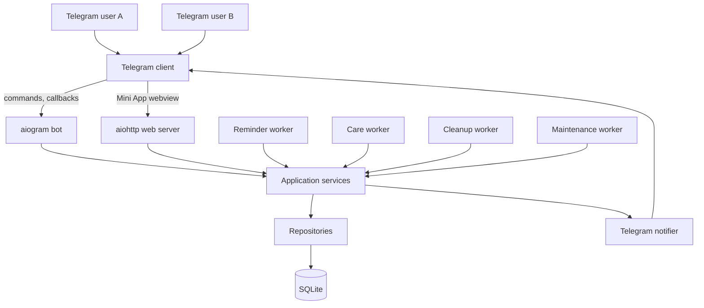
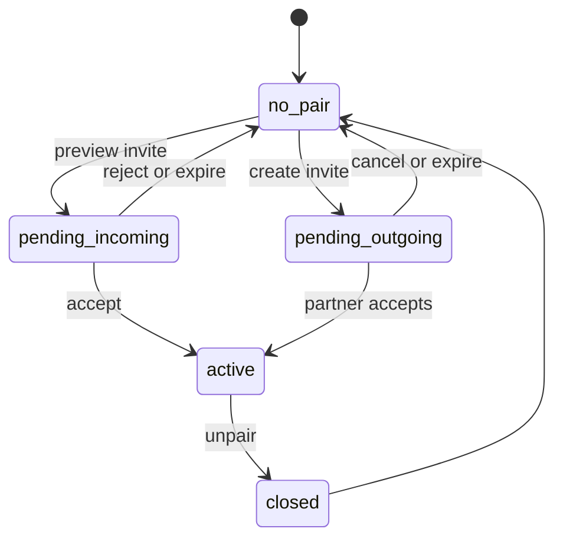

# Nimarita - Production Architecture

## 1. What this application is

Nimarita is a single-service Telegram product for confirmed romantic pairs 1:1.

It consists of:

- a Telegram bot used for `/start`, commands, callbacks, and message delivery;
- a Telegram Mini App used as the main workspace;
- an async Python backend that owns the product state;
- a SQLite database that stores pair state, reminders, care messages, UI state, and audit logs.

The current production shape is intentionally narrow:

- one user can belong to at most one active pair;
- reminders exist only inside an active pair;
- care messages exist only inside an active pair;
- Telegram private chat is required for outbound bot delivery;
- backend state is authoritative; the Mini App only renders and mutates it.

## 2. Product responsibilities

The current codebase implements four main domains:

1. Pairing
2. Reminders
3. Care messages
4. Telegram Mini App and bot delivery

It does not implement:

- multi-partner relationships;
- group relationships;
- multi-instance horizontal scaling;
- public third-party API integrations;
- admin backoffice.

## 3. Runtime topology

Operational assumption: this topology is designed for one process and one writable SQLite database.

## 4. Code layout and responsibilities

### `nimarita/app.py`

Composition root. Builds repositories, services, notifier, web server, workers, and command registration.

`Runtime.start()` currently performs:

1. `bot.get_me()`
2. startup reconciliation
3. startup database audit
4. deployment warnings logging
5. optional startup backup
6. worker startup
7. web server startup
8. Telegram menu sync

`Runtime.close()` stops workers and web server, performs graceful shutdown maintenance, closes DB, and closes the bot session.

### `nimarita/runner.py`

Process lifecycle:

- loads settings;
- configures logging;
- builds runtime;
- starts polling;
- closes resources on shutdown.

### `nimarita/config.py`

Environment-backed settings model. It also resolves:

- persistent storage defaults under `RAILWAY_VOLUME_MOUNT_PATH`;
- automatic SQLite journal mode selection;
- web host/port/origin configuration;
- worker cadence and retry parameters.

### `nimarita/domain`

Pure domain layer:

- enums;
- dataclasses;
- domain errors.

Important enums currently define the state machines for:

- pairs;
- invites;
- reminder rules;
- reminder occurrences;
- care dispatches;
- ephemeral message cleanup.

### `nimarita/infra/sqlite.py`

Database bootstrap and operational hardening:

- schema creation;
- additive compatibility migrations;
- PRAGMA configuration;
- integrity checks;
- backup and checkpoint helpers.

### `nimarita/repositories`

Persistence boundary. Repositories own SQL and row-level persistence logic, including:

- active-pair checks;
- invite persistence;
- reminder rule and occurrence persistence;
- care history persistence;
- UI panel tracking;
- audit log writes.

### `nimarita/services`

Use-case layer. Services enforce business rules and sequence repository work. Core services are:

- `UserService`
- `PairingService`
- `ReminderService`
- `CareService`
- `AuditService`
- `SystemService`
- `AccessPolicy`

### `nimarita/telegram`

Telegram interface layer:

- command handlers;
- callback handlers;
- persistent dashboard rendering;
- delivery formatting;
- menu synchronization;
- ephemeral bot messages.

### `nimarita/web`

Mini App server layer:

- Telegram `initData` verification;
- session token issuance and verification;
- HTTP API endpoints;
- static `index.html` serving.

### `nimarita/workers`

Background loops:

- reminder worker;
- care worker;
- ephemeral cleanup worker;
- SQLite maintenance worker.

## 5. Trust boundaries

### Trusted server-side decisions

- validated Telegram identity from `initData`;
- active pair ownership and recipient resolution;
- reminder recurrence normalization;
- care template role filtering;
- DB triggers preventing overlapping active pairs.

### Untrusted client-side input

- Mini App request bodies;
- `start_param` in the auth request body;
- any browser-side state cache;
- any inferred frontend mode.

The backend always recomputes canonical state before returning UI payloads.

## 6. Canonical invariants

These invariants define the application and must not be broken.

### Pair invariants

- A user can have at most one active pair.
- `pairs.user_a_id < pairs.user_b_id` is canonical.
- Both users must have completed `/start` before pair confirmation.
- Unpairing must cascade into reminder and care cancellation/failure for open work.

### Invite invariants

- Invite tokens are stored hashed, not in plaintext.
- Invite preview does not bind a web-only user before the user has started the bot and has a private chat.
- Pending invites expire by TTL and during reconciliation.
- Confirming a pair expires conflicting pending invites touching either user.

### Reminder invariants

- Reminders are pair-scoped.
- Creator is always one member of the active pair; recipient is always the partner.
- Scheduling is defined in creator local time and stored in UTC.
- Rule and occurrence are separate concepts.
- Recipient actions operate on occurrences, not rules.

### Care invariants

- Care messages are pair-scoped.
- Sender and recipient are resolved from the active pair, not from arbitrary request data.
- Templates are role-filtered.
- Partner must have started the bot and have a private chat for delivery.
- Responses can be recorded only once per sent dispatch.

## 7. Pair lifecycle architecture

The architectural path is:

1. user issues invite;
2. invite is previewed;
3. confirmation requires both users to have started the bot;
4. pair becomes active and unlocks reminders/care;
5. unpair closes the pair and cancels open pair-scoped work.

## 8. Reminder architecture

Reminder processing is split into two levels:

- `reminder_rules` define intent;
- `reminder_occurrences` define operational deliveries.

This split enables:

- recurrence;
- retry scheduling;
- ack and snooze actions;
- history and delivery metadata.

High-level delivery path:

1. create or update rule;
2. create next scheduled occurrence;
3. worker claims due occurrence;
4. notifier sends Telegram message with actions;
5. service marks success or schedules retry;
6. if recurring, next occurrence is scheduled after successful delivery.

## 9. Care architecture

Care uses a queued dispatch model.

There are two creation paths:

- seeded template send;
- custom message send.

Delivery path:

1. sender queues dispatch;
2. worker claims pending dispatch;
3. notifier sends Telegram card with optional quick replies;
4. recipient responds by Telegram callback or Mini App API;
5. original sender receives response notification.

The care catalog is seeded and upserted into the database. Dispatches store payload snapshots so historical messages survive template changes.

## 10. Mini App architecture

The Mini App is a single-file frontend in `nimarita/web/static/index.html`.

Bootstrap path:

1. apply Telegram theme;
2. call `tg.ready()`;
3. call `tg.expand()`;
4. call `POST /api/v1/auth`;
5. store session token;
6. render backend-provided state;
7. auto-refresh every 30 seconds while the page is active.

Important architectural rule: the frontend does not infer pair/reminder/care state from partial fields. `state.mode` and server payloads are canonical.

## 11. Telegram bot architecture

The bot has two roles:

- product entry point;
- delivery channel for reminders, care messages, confirmations, and failures.

Current command surface:

- `/start`
- `/open`
- `/pair`
- `/profile`
- `/status`
- `/remind`
- `/care`
- `/help`
- `/unpair`

Important interface behavior:

- `/start` registers the user and sets `started_bot = true`;
- dashboard messages are upserted rather than spammed;
- reminder and care deliveries include inline actions;
- ephemeral messages are tracked and deleted later.

## 12. Security and access model

Current protections include:

- Telegram `initData` HMAC verification;
- stateless HMAC session tokens;
- allowlist gating via `AccessPolicy`;
- session recheck on every protected web request;
- request body validation for JSON objects;
- role and pair ownership checks in services.

Known architectural gaps still present:

- `start_param` is still trusted from the auth request body and is not server-signed;
- some error distinctions can still reveal not-found vs conflict vs permission differences;
- single-instance assumptions are operational, not enforced by distributed coordination.

## 13. What is important not to break

The following behaviors are load-bearing:

- active-pair uniqueness across both service logic and DB triggers;
- canonical pair ordering;
- `/start` requirement before pair confirmation;
- rule/occurrence split for reminders;
- care response single-write semantics;
- session verification and allowlist recheck;
- startup reconciliation of stale `processing` work;
- single-instance deployment assumption.

## 14. Current architectural risks

These are real current-state risks, not hypothetical future issues.

- SQLite is a single-writer persistence model; running multiple Railway replicas against the same DB is unsafe.
- Startup migrations are additive bootstrap logic, not formal versioned migrations.
- Reminder delivery state transitions are not fully guarded by expected previous-state rowcount checks, so duplicate completion races remain possible.
- Backup restore validation is still manual and operational.
- Session security degrades if `APP_SESSION_SECRET` is left equal to `BOT_TOKEN`.

## 15. Recommended continuation path

Safe next steps for continued development:

1. Formalize DB migrations.
2. Extract the Mini App into modules without changing API contracts.
3. Strengthen reminder state transitions against duplicate completion races.
4. Replace unsigned `start_param` trust with a server-owned invite/session flow.
5. Add restore drills and stronger operational checks around backups.
