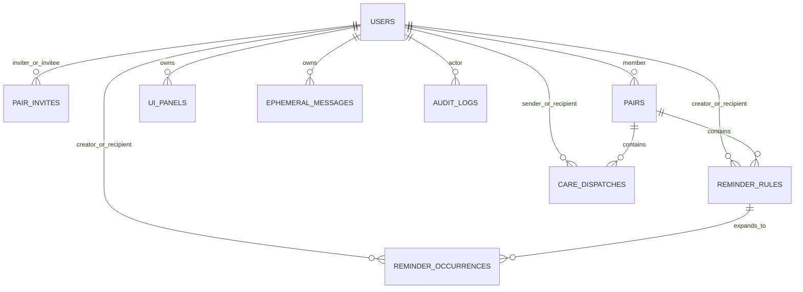
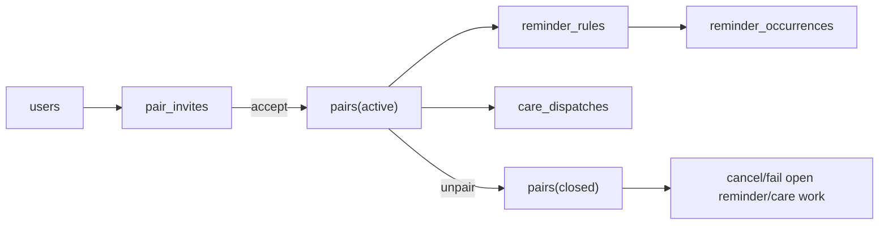

# Nimarita - Production Data Model

## 1. Persistence model overview

The current persistence model is SQLite-first and optimized for a single-service deployment.

The design principles are:

- explicit state columns instead of implicit lifecycle inference;
- normalized core entities;
- append-like operational tables for delivery work;
- additive schema evolution during bootstrap;
- database-level protection for the active-pair invariant.

## 2. Entity map

## 3. Core tables

### `users`

Canonical user record.

Important columns:

- `telegram_user_id UNIQUE`
- `private_chat_id`
- `timezone`
- `relationship_role`
- `started_bot`
- `created_at`
- `updated_at`

Important meaning:

- `started_bot` distinguishes a full bot onboarding from a web-only touch;
- `private_chat_id` is required for actual Telegram delivery;
- `relationship_role` drives care-template filtering and copy hints.

### `pair_invites`

Invitation lifecycle table.

Important columns:

- `inviter_user_id`
- `invitee_user_id`
- `token_hash UNIQUE`
- `status`
- `expires_at`
- `consumed_at`

Important meaning:

- raw invite tokens are not stored;
- `invitee_user_id` may remain empty until a valid preview/bind flow;
- invite lifecycle is explicit: pending, accepted, rejected, expired.

### `pairs`

Current or historical pair relationship.

Important columns:

- `user_a_id`
- `user_b_id`
- `status`
- `created_by_user_id`
- `confirmed_at`
- `closed_at`

Important meaning:

- `(user_a_id, user_b_id)` is always canonical and ordered;
- only one active pair touching a user is allowed.

### `reminder_rules`

Long-lived reminder definition.

Important columns:

- `pair_id`
- `creator_user_id`
- `recipient_user_id`
- `kind`
- `text`
- `creator_timezone`
- `origin_scheduled_at_utc`
- `recurrence_every`
- `recurrence_unit`
- `status`
- `cancelled_at`

Important meaning:

- rule rows model user intent;
- rule rows do not represent each delivery attempt.

### `reminder_occurrences`

Operational reminder delivery unit.

Important columns:

- `rule_id`
- `pair_id`
- `creator_user_id`
- `recipient_user_id`
- `text`
- `scheduled_at_utc`
- `next_attempt_at_utc`
- `status`
- `handled_action`
- `telegram_message_id`
- `delivery_attempts_count`
- `last_error`
- `sent_at`
- `delivered_at`
- `acknowledged_at`
- `cancelled_at`

Important meaning:

- each due delivery is an occurrence row;
- retries and ack/snooze mutate occurrences, not rules.

### `care_templates`

Seeded care catalog.

Important columns:

- `template_code UNIQUE`
- `category`
- `category_label`
- `title`
- `body`
- `emoji`
- `sender_role`
- `recipient_role`
- `is_active`
- `sort_order`

Important meaning:

- template rows are catalog definitions, not message history;
- role-aware filtering is resolved at send time.

### `care_dispatches`

Operational care send history and response tracking.

Important columns:

- `pair_id`
- `sender_user_id`
- `recipient_user_id`
- `template_code`
- `category`
- `category_label`
- `title`
- `body`
- `emoji`
- `status`
- `telegram_message_id`
- `response_code`
- `response_title`
- `response_body`
- `response_emoji`
- `response_clicked_at`
- `next_attempt_at_utc`
- `processing_started_at`
- `delivery_attempts_count`
- `sent_at`
- `delivered_at`
- `last_error`

Important meaning:

- dispatch rows persist exact sent content;
- history remains stable even if the template catalog changes later.

### `ui_panels`

Tracks persistent Telegram dashboard messages per `user_id + panel_key`.

This is what allows safe dashboard upsert instead of repeated message spam.

### `ephemeral_messages`

Tracks short-lived bot messages for delayed deletion by the cleanup worker.

### `audit_logs`

Append-style audit trail.

Important columns:

- `actor_user_id`
- `entity_type`
- `entity_id`
- `action`
- `payload_json`
- `request_id`
- `created_at`

## 4. State enums

### Pair status

- `active`
- `closed`

### Invite status

- `pending`
- `accepted`
- `rejected`
- `expired`

### Relationship role

- `unspecified`
- `woman`
- `man`

### Reminder rule kind

- `one_time`
- `daily`
- `weekdays`
- `weekly`
- `interval`

### Reminder interval unit

- `hour`
- `day`
- `week`
- `month`

### Reminder rule status

- `active`
- `cancelled`

### Reminder occurrence status

- `scheduled`
- `processing`
- `delivered`
- `acknowledged`
- `failed`
- `cancelled`

### Care dispatch status

- `pending`
- `processing`
- `sent`
- `responded`
- `failed`

### Ephemeral message status

- `pending`
- `deleted`
- `failed`

## 5. Database-level invariants

These invariants are enforced by schema, index, or trigger behavior.

### Canonical pair ordering

`pairs` uses `CHECK (user_a_id < user_b_id)`.

### One active pair per user

The database contains trigger protection so inserts and updates cannot create overlapping active pairs for the same user.

### Unique active canonical pair

The active pair index prevents duplicate active pair rows for the same canonical pair.

### Unique invite token

`pair_invites.token_hash` is unique.

### Pending invite control

There is a partial uniqueness constraint around pending outgoing invites per inviter.

## 6. Why reminders use rule + occurrence split

This is the most important modeling choice in the app outside the pair invariant.

It enables:

- recurring schedules without mutating historical sends;
- retries without rewriting the source rule;
- recipient actions on specific deliveries;
- better auditability for failed or snoozed reminders;
- safe cancellation of future scheduled work.

Without this split the reminder lifecycle would be much harder to recover and debug.

## 7. Pair lifecycle at the data level

The current lifecycle is:

1. user exists;
2. invite row is created;
3. pair row is created on accept;
4. reminder and care rows are allowed only while the pair is active;
5. unpair closes the pair and cascades through open reminder/care work.

## 8. Reminder scheduling model

Reminder scheduling stores creator intent in two forms:

- original local scheduling context via `creator_timezone`;
- operational execution timestamps in UTC.

This allows:

- stable user-facing scheduling semantics;
- background processing independent of client timezone;
- recurrence computation after delivery.

Supported recurrence families are:

- one-time;
- daily;
- weekdays;
- weekly;
- interval with `recurrence_every + recurrence_unit`.

## 9. Care messaging model

Care is modeled as:

1. catalog templates;
2. dispatch snapshots;
3. optional reply payload on the dispatch row.

The snapshot approach matters because:

- history must remain readable after template updates;
- sender/recipient should see the exact payload that was delivered;
- response metadata belongs to the sent message, not to the template.

## 10. SQLite runtime characteristics

Connection setup currently enables:

- foreign keys;
- configured journal mode;
- configured synchronous mode;
- busy timeout;
- WAL autocheckpoint when relevant;
- temp store in memory;
- `trusted_schema = OFF` when supported.

Writes are serialized through an async lock and `BEGIN IMMEDIATE`.

This is safe for one process. It is not a substitute for multi-process coordination.

## 11. Known persistence risks

These risks exist in the current code.

- Schema evolution is additive bootstrap logic, not formal versioned migrations.
- Backup restore validation is manual.
- Backup filenames use second-level resolution and can theoretically collide within the same second.
- Reminder completion transitions are not fully guarded against duplicate terminal writes.

## 12. What must not be broken

If these rules are broken, product correctness degrades immediately.

- active-pair uniqueness;
- canonical pair ordering;
- invite token hashing;
- `/start` gate before pair confirmation;
- reminder rule/occurrence split;
- care dispatch history as immutable snapshot;
- pair-scoped ownership on reminders and care rows.
