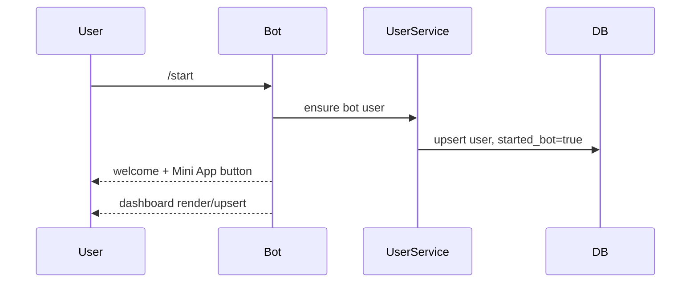
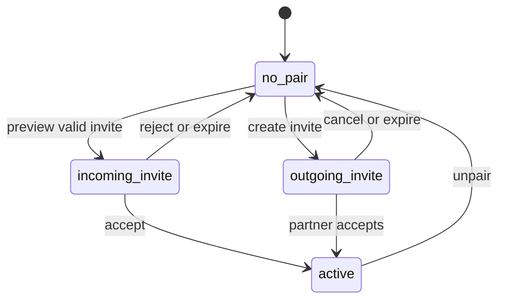

# Nimarita - User Flows

## 1. Why user flows matter in this project

Nimarita is small in codebase size but strict in lifecycle rules.

The critical thing for a new developer is not only what screens exist, but which transitions are allowed and what conditions unlock them.

The main flows are:

1. Telegram bot onboarding
2. Invite and pair confirmation
3. Reminder creation and delivery
4. Care message creation and response
5. Mini App state bootstrap and refresh
6. Unpair and cleanup

## 2. Telegram bot onboarding flow

Effects:

- user record exists;
- `started_bot = true`;
- `private_chat_id` becomes known;
- the user is now eligible for pair confirmation and delivery.

## 3. Invite and pair lifecycle

### 3.1 Invite creation

Preconditions:

- inviter exists;
- inviter does not already have an active pair;
- inviter has completed `/start`;
- invitee is not yet fixed unless preview/bind succeeds.

Flow:

1. user creates invite from bot or Mini App;
2. previous pending outgoing invite from the same inviter is expired;
3. new pending invite is created with TTL;
4. raw token is returned only in the response payload;
5. user shares bot deep link or Mini App link.

### 3.2 Invite preview

Current important rule:

- web-only preview does not bind the invite to the viewer until the viewer has started the bot and has a private chat.

This prevents accidental binding from a browser-only visit.

### 3.3 Invite acceptance

Preconditions:

- invite is pending;
- accepting user is not the inviter;
- invite is valid for this user;
- both users have `started_bot = true`;
- neither user is already in an active pair.

Flow:

1. accept by token or invite id;
2. backend validates/binds invite;
3. canonical pair row is created;
4. conflicting pending invites are expired;
5. both users can now use reminders and care.

### 3.4 Invite rejection

Flow:

1. reject by token or invite id;
2. invite is marked rejected;
3. rejector may become bound as invitee for audit consistency;
4. inviter receives bot notification.

### 3.5 Unpair

Flow:

1. actor confirms unpair in bot or Mini App;
2. pair row is closed;
3. open reminder work is cancelled;
4. open care work is cancelled or failed;
5. both users return to non-active-pair state.

## 4. Dashboard mode flow

`PairingService.get_dashboard(...)` is the canonical source for this mode.

## 5. Mini App flow

### 5.1 First open

Flow:

1. user opens Mini App from Telegram;
2. frontend sends `init_data` and `start_param` to `/api/v1/auth`;
3. backend verifies Telegram payload and creates session token;
4. backend returns `state`, `reminders`, `care_templates`, `care_history`;
5. frontend renders the canonical mode.

### 5.2 Ongoing use

Flow:

1. frontend holds bearer token in memory;
2. user performs actions against protected endpoints;
3. frontend refreshes state every 30 seconds while visible;
4. on visibility restore, state refresh runs again.

### 5.3 Failure mode

If auth bootstrap fails:

- the UI enters fatal startup error mode;
- there is no partial state rendering;
- the user must retry from Telegram context.

## 6. Telegram bot flow

### Supported command flows

- `/start` - register and open entry point
- `/open` - open Mini App workspace
- `/pair` - create invite
- `/profile` - choose role
- `/status` - refresh dashboard
- `/remind` - direct reminder entry or help
- `/care` - open care entry point
- `/help` - usage help
- `/unpair` - destructive pair flow

### Important callback flows

- `pair:create`
- `invite:cancel_outgoing`
- `invite:accept:<id>`
- `invite:reject:<id>`
- `pair:ask_unpair`
- `pair:confirm_unpair`
- `profile:set:<role>`
- `reminder:done:<occurrence_id>`
- `reminder:snooze:<occurrence_id>:<minutes>`
- `care:page:<dispatch_id>:<page>`
- `care:reply:<dispatch_id>:<reply_code>`
- `care:hide:<dispatch_id>`

The bot is not a fallback UI only. It is a core part of delivery and confirmation flows.

## 7. Reminder flow

### 7.1 Create reminder

Preconditions:

- user has active pair;
- target recipient is the partner;
- text is valid;
- scheduled local time resolves to a future UTC time.

Flow:

1. user submits reminder form;
2. backend normalizes recurrence;
3. backend updates creator timezone;
4. backend creates rule plus first occurrence;
5. backend may reuse an equivalent recent reminder instead of duplicating it.

### 7.2 Deliver reminder

Flow:

1. reminder worker polls due scheduled occurrences;
2. worker claims occurrence;
3. notifier sends Telegram message to recipient;
4. occurrence becomes delivered;
5. if recurring, next occurrence is scheduled.

### 7.3 Recipient actions

Recipient can:

- mark as done;
- snooze for 1 to 120 minutes.

Done marks the occurrence acknowledged.

Snooze creates a follow-up occurrence.

### 7.4 Edit or cancel reminder

Creator-only flow:

1. creator loads reminders for active pair;
2. creator updates rule and nearest scheduled occurrence;
3. extra future scheduled occurrences are cancelled;
4. cancel turns rule inactive and cancels open occurrences.

## 8. Care message flow

### 8.1 Send template

Preconditions:

- active pair exists;
- template matches sender/recipient roles;
- recipient has started the bot;
- rate limits and duplicate-window checks pass.

Flow:

1. sender chooses template;
2. backend queues dispatch;
3. care worker claims dispatch;
4. notifier sends Telegram card.

### 8.2 Send custom message

Flow:

1. sender submits title/message/emoji;
2. backend normalizes values and validates lengths;
3. backend may reuse an equivalent recent custom dispatch;
4. dispatch enters queue;
5. worker sends it through Telegram.

### 8.3 Respond to care message

Two response paths exist:

- quick reply;
- custom reply.

Rules:

- only recipient can respond;
- only one response is allowed;
- response updates the dispatch row to `responded`;
- original sender receives response notification.

## 9. Cleanup and recovery flows

### Startup reconciliation

On service start:

- expired invites are closed;
- stale reminder `processing` items are requeued;
- stale care `processing` items are requeued.

### Ephemeral cleanup

Cleanup worker deletes temporary bot messages tracked in `ephemeral_messages`.

### Maintenance loop

Maintenance worker performs:

- checkpointing;
- quick checks;
- scheduled backups.

## 10. Failure scenarios

### User opens Mini App outside Telegram

Expected result:

- auth fails;
- user sees a clean bootstrap failure;
- no invalid session is created.

### Reminder did not send

Check:

- worker health;
- recipient `private_chat_id`;
- occurrence status and retry counters;
- pair still active.

### Care message did not send

Check:

- worker health;
- rate limit and duplicate window;
- recipient bot onboarding status;
- dispatch retries/final failure.

### Pair unexpectedly unavailable

Check:

- conflicting active-pair guard behavior;
- invite acceptance prerequisites;
- unpair cascade side effects.

## 11. What is important not to break

- web-only invite preview must not prematurely capture the invite;
- both users must complete `/start` before pair confirmation;
- reminders and care must remain locked behind an active pair;
- unpair must cascade through open reminder and care work;
- Mini App must continue to render only backend-provided canonical state.
