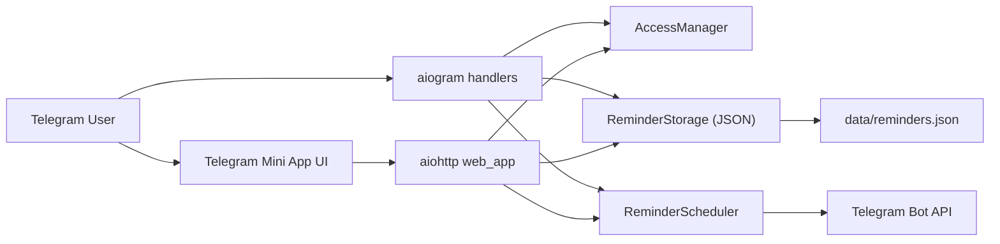
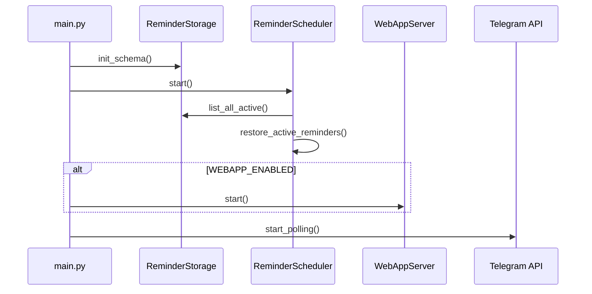
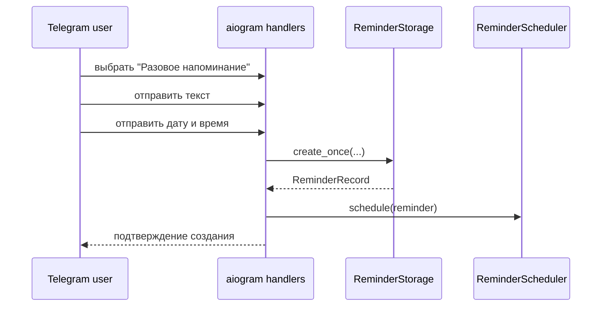
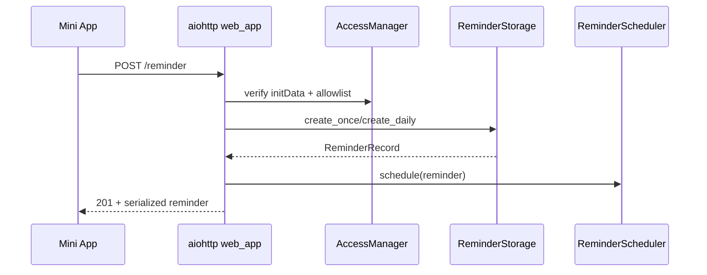
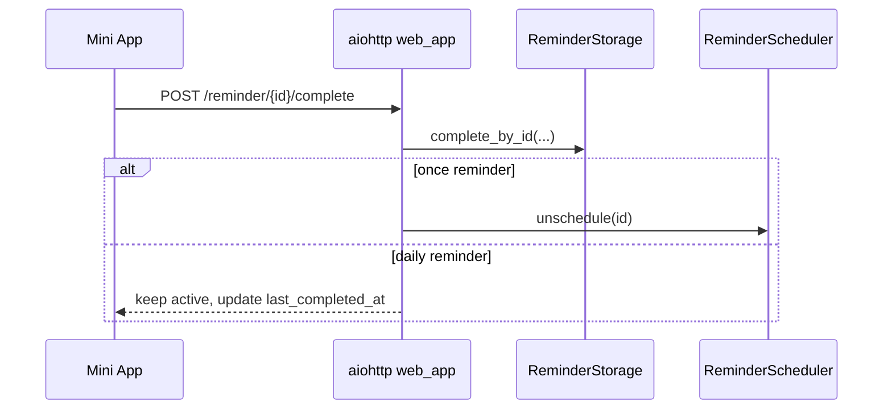

# Архитектура Nimarita Love Bot

## 1. Назначение системы

`nimarita_love` — приватный Telegram-бот для пары. Система помогает:

- создавать заботливые и бытовые напоминания;
- адресовать их себе или партнёру;
- хранить активные напоминания между рестартами;
- работать как через обычный чат, так и через Telegram Mini App.

Система intentionally small и монолитна: bot runtime, scheduler, storage и web backend живут в одном Python-процессе.

## 2. Архитектурный обзор



### Ключевые свойства архитектуры

- **Один процесс**: нет отдельного scheduler-service или отдельного web backend.
- **Один persistent source of truth**: `data/reminders.json`.
- **Один security gate**: `AccessManager` используется и aiogram-слоем, и web_app.
- **Один delivery mechanism**: фактическую отправку в Telegram выполняет `ReminderScheduler`.

## 3. Точки входа

### `main.py`

Главная orchestration-точка:

1. настраивает logging;
2. создаёт `Bot` и `Dispatcher`;
3. инициализирует `ReminderStorage`;
4. поднимает `ReminderScheduler`;
5. при необходимости поднимает `WebAppServer`;
6. подключает router через `create_router(...)`;
7. запускает polling.

### Runtime lifecycle



## 4. Компоненты

## 4.1 `config.py`

Отвечает за:

- загрузку `.env`;
- нормализацию базовых директорий;
- объявление runtime-констант;
- конфигурацию Mini App, timezone и delivery retry;
- обязательную валидацию `BOT_TOKEN`.

Практическое следствие:

- приложение не стартует без `BOT_TOKEN`;
- `data/` и `logs/` создаются на старте автоматически;
- зона по умолчанию фиксирована как `Europe/Moscow`.

## 4.2 `bot/models.py`

Содержит `ReminderRecord` и type alias `ReminderKind`.

Это основной доменный контракт между:

- handler-layer,
- storage-layer,
- scheduler-layer,
- Mini App API serialization.

Все слои опираются на один и тот же dataclass, поэтому проект не разводит отдельные ORM/DTO/transport models.

## 4.3 `bot/storage.py`

### Роль

`ReminderStorage` — это in-process repository над JSON-файлом.

### Основные свойства

- использует `asyncio.Lock` для защиты критических секций;
- лениво загружает файл при первом обращении;
- сохраняет весь payload целиком на каждую мутацию;
- нормализует `datetime` через `ZoneInfo`;
- сам генерирует `reminder_id`.

### Поддерживаемые операции

- `create_once(...)`
- `create_daily(...)`
- `list_active_by_chat(...)`
- `list_active_by_recipient_chat(...)`
- `list_accessible_by_chat(...)`
- `list_all_active(...)`
- `get_active_by_id(...)`
- `complete_by_id(...)`
- `deactivate_for_chat(...)`
- `deactivate_by_id(...)`

### Модель доступа к данным

Файл `data/reminders.json` содержит список объектов:

```json
[
  {
    "reminder_id": 1,
    "chat_id": 111111111,
    "recipient_chat_id": 222222222,
    "timezone": "Europe/Moscow",
    "text": "Написать вечером",
    "kind": "daily",
    "recurring": true,
    "run_at": null,
    "daily_time": "21:00",
    "voice": false,
    "voice_file_id": null,
    "last_completed_at": null,
    "is_active": true,
    "created_at": "2026-03-18T20:00:00+03:00"
  }
]
```

### Нюансы

- Это **не** БД и **не** append-only журнал.
- При битом JSON storage перезапускается в пустое состояние, логируя ошибку.
- Хранилище безопасно только в рамках **одного процесса**.

## 4.4 `bot/scheduler.py`

### Роль

`ReminderScheduler` отвечает за lifecycle scheduled jobs и фактическую доставку уведомлений в Telegram.

### Внутренний механизм

- `AsyncIOScheduler` из APScheduler.
- Для `once` используется `DateTrigger`.
- Для `daily` используется `CronTrigger`.

### Поведение при старте

При `start()` планировщик:

1. стартует внутренний APScheduler;
2. получает все активные записи из storage;
3. восстанавливает jobs в памяти процесса.

### Поведение для `once`

- если `run_at` в прошлом, запись деактивируется;
- если доставка успешна, запись деактивируется;
- если доставка провалилась по `TelegramAPIError`, ставится retry job;
- если пользователь заблокировал бота (`TelegramForbiddenError`), запись деактивируется.

### Поведение для `daily`

- job остаётся активным;
- `complete_by_id()` только обновляет `last_completed_at`, но не снимает job;
- daily reminder нужно деактивировать явно.

### Формирование текста

Scheduler добавляет случайную романтичную подводку из `ROMANTIC_OPENERS`, затем основной текст напоминания.

Следствие:

- user-facing сообщение формируется не в handler-layer, а в delivery-layer;
- бизнес-смысл “заботливое напоминание” живёт именно в scheduler.

## 4.5 `bot/profiles.py`

### Роль

Модуль реализует реестр участников пары на базе `profiles.json`.

### Что умеет

- загружать профили из файла;
- искать профиль по `id`;
- резолвить по `label`;
- резолвить по role (`boyfriend`, `girlfriend`, `self`) при уникальном соответствии;
- отдавать список доступных получателей для Mini App UI.

### Почему это важно

`profiles.json` — это не просто metadata-файл, а фактически **основной доменный allowlist** приватного режима.

## 4.6 `bot/access.py`

### Роль

`AccessManager` — единая точка авторизации для всего приложения.

### Логика принятия решения

1. Если `profiles.json` содержит профили, пользователь обязан присутствовать в реестре.
2. Если задан `ALLOWED_USER_IDS`, пользователь обязан быть в allowlist.
3. Если задан `ALLOWED_CHAT_IDS`, чат обязан быть в allowlist.

Если любое условие нарушено, бросается `AccessDeniedError`.

### Дополнительная функция

`resolve_recipient(...)` умеет определить получателя:

- по numeric ID;
- по строковому ID;
- по label из `profiles.json`;
- по role, если роль уникальна в текущем реестре.

Это особенно полезно для Mini App и будущих расширений API.

## 4.7 `bot/handlers.py`

### Роль

Aiogram router обслуживает Telegram chat UX.

### Поддерживаемые сценарии

- `/start`
- `/menu`
- `/cancel`
- создание разового напоминания через FSM
- создание ежедневного напоминания через FSM
- просмотр активных напоминаний
- удаление напоминания через callback
- fallback-route для неопознанных сообщений

### FSM-состояния

```text
ReminderFlow.once_text
ReminderFlow.once_datetime
ReminderFlow.daily_text
ReminderFlow.daily_time
```

### Ограничения chat UX

- сценарий создания ориентирован только на текстовые напоминания;
- completion через чат напрямую не реализован, основной flow completion вынесен в web API;
- state storage in-memory, поэтому незавершённые диалоги не переживают рестарт процесса.

## 4.8 `bot/keyboards.py`

Содержит Telegram inline-keyboards:

- main menu;
- cancel;
- список кнопок удаления активных напоминаний.

Если `WEBAPP_URL` заполнен, в главное меню добавляется кнопка `Mini App`.

## 4.9 `bot/web_app.py`

### Роль

Встроенный aiohttp backend для Telegram Mini App.

### HTTP endpoints

| Метод | URL | Назначение |
| --- | --- | --- |
| `GET` | `/` | отдать `webapp/index.html` |
| `POST` | `/auth` | проверить `initData`, вернуть профиль и список получателей |
| `GET` | `/reminders` | вернуть список доступных напоминаний |
| `POST` | `/reminder` | создать напоминание |
| `POST` | `/reminder/{id}/complete` | отметить напоминание выполненным |
| `GET` | `/health` | healthcheck |

### Security model Mini App

Все защищённые запросы проходят через:

1. извлечение `initData` из header/query/body;
2. проверку Telegram signature;
3. проверку TTL;
4. построение `TelegramAuthContext`;
5. проверку allowlist через `AccessManager`.

### Telegram `initData` verification

Модуль `TelegramInitDataVerifier`:

- собирает `data_check_string`;
- вычисляет HMAC SHA-256 через Telegram WebApp scheme;
- сравнивает `hash` через `hmac.compare_digest`;
- проверяет `auth_date`;
- извлекает `user` / `receiver` / `chat`.

### Контракты создания напоминания

#### Разовое напоминание

Поддерживаемые формы входных данных:

- `run_at`
- `datetime`
- `date` + `time`
- `time` без даты (тогда берётся ближайшее следующее вхождение)

#### Ежедневное напоминание

Нужны:

- `kind = daily`
- `daily_time` или `time`

#### Голосовой режим

Backend принимает:

- `voice`
- `voice_file_id`
- алиасы `voice_file`, `mediaFileId`

Но стандартный frontend пока не содержит UI для выбора голосового сообщения.

## 4.10 `webapp/index.html`

Frontend — один статический HTML-файл с inline CSS/JS.

### Что делает UI

- получает `window.Telegram.WebApp`;
- отправляет `initData` в backend;
- синхронизирует тему Telegram;
- показывает профиль и список доступных получателей;
- создаёт разовые и ежедневные напоминания;
- фильтрует список `all / once / daily`;
- отмечает записи выполненными;
- использует haptic feedback и MainButton Telegram SDK.

### Архитектурная особенность

Frontend не требует Node.js, bundler и frontend pipeline. Это минималистичный deploy-friendly подход:

- проще запускать;
- проще хостить вместе с Python runtime;
- сложнее масштабировать и поддерживать при росте UI-логики.

## 5. Потоки данных

## 5.1 Создание разового напоминания из чата



## 5.2 Создание напоминания из Mini App



## 5.3 Completion



## 6. Доменные правила

- Разовые напоминания после успешной доставки становятся неактивными.
- Ежедневные напоминания после completion остаются активными.
- Если `recipient_chat_id` не передан, получателем становится сам создатель.
- Просмотр и completion разрешены обоим участникам: и создателю, и получателю.
- Удаление через Telegram chat flow разрешено только создателю (`deactivate_for_chat`).

## 7. Наблюдения по качеству текущей реализации

### Сильные стороны

- Чистое разделение на storage / scheduler / access / transport layers.
- Повторное использование одной access-модели для chat и web.
- Есть тесты на security-critical часть (`initData`) и доменные правила completion.
- Нет блокирующего file I/O на event loop: чтение и запись файла идут через `asyncio.to_thread`.

### Архитектурные ограничения

- Нет горизонтального масштабирования: два процесса будут конфликтовать по JSON storage и scheduling.
- Нет idempotency guard для повторной доставки при process crash между send и deactivate.
- Нет durable job store APScheduler.
- Нет audit trail и history-таблицы completion.
- Нет административной диагностики кроме `/health` и логов.

## 8. Направления развития

### Ближайшие

- перенести storage с JSON на SQLite/PostgreSQL;
- enforced validation для `MAX_REMINDER_TEXT_LENGTH` и `MAX_ACTIVE_REMINDERS_PER_CHAT`;
- добавить completion / snooze / edit flows в chat interface;
- добавить first-class voice reminder flow;
- нормализовать public API и оформить OpenAPI schema.

### Следующий уровень

- webhook mode вместо polling;
- job store в БД;
- multi-tenant модель вместо жёсткого `profiles.json`;
- observability: structured logging, metrics, delivery dashboard.
